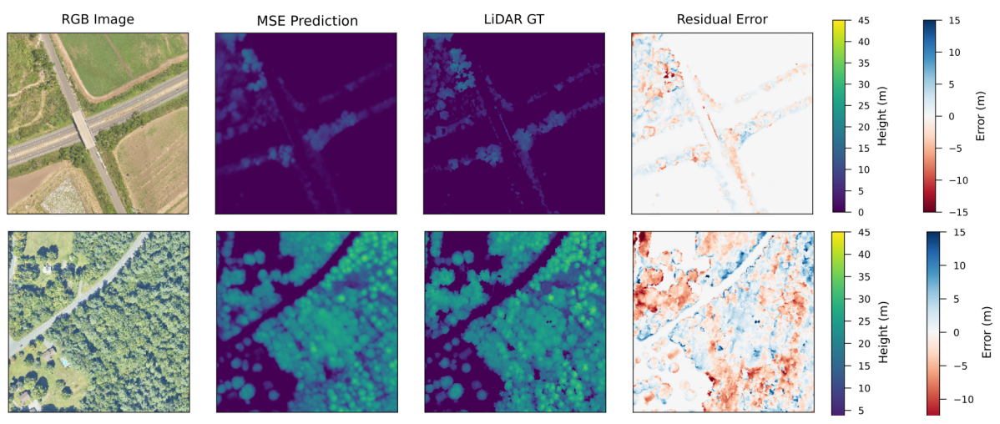

# A High-Resolution Canopy Height Model using a Deep Learning Approach

This repository contains the implementation of a deep learning framework designed to estimate forest canopy height from RGB aerial imagery. By integrating **Hierarchical Vision Transformers (MiT-B5)** into a **U-Net** architecture, the model captures both local textures and global spatial contexts, achieving high precision in diverse forest ecosystems.

## 🚀 Key Results
* **Coefficient of Determination in the validation set ($R^2$):** 0.93
* **Training Dataset:** ~20,629 patches from the NEON network.
* **Spatial Resolution:** 1 meter per pixel.

## 🛠️ Architecture
The core of this project is a hybrid encoder-decoder structure:
- **Encoder:** Mix Transformer (MiT-B5) - Provides a powerful hierarchical representation of forest patterns.
- **Decoder:** U-Net style upsampling to recover spatial resolution for precise height mapping.
- **Data Format:** Optimized HDF5 handling for big datasets (23k+ patches).
  



## 📁 Repository Structure
```text
├── assets/             # resources for the README.md
├── data/               # Instructions for HDF5 dataset structure
├── models/             # Architecture definition (MiT-B5 + U-Net)
├── scripts/            # Training (train.py) and Inference (predict.py)
├── test_images/        # Sample images and download instructions
├── requirements.txt    # Required libraries (PyTorch, SMP, H5py)
└── README.md           # Project documentation

